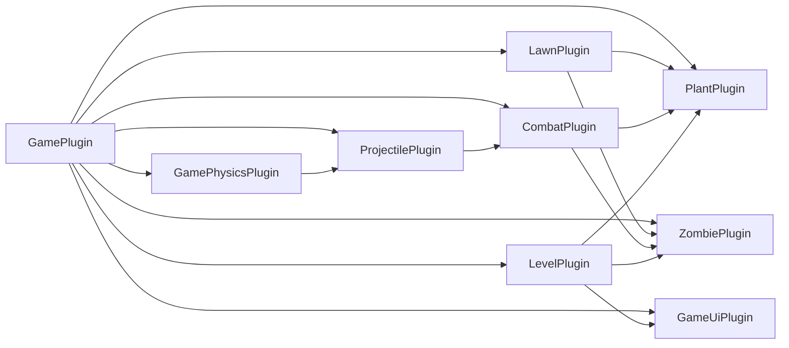

# bevy-pvz

一个使用 Bevy 和 Rapier 2D 编写的可玩单关 PvZ 类游戏原型。当前版本已经接通种植、经济、波次、战斗、物理弹丸和胜负重开闭环。

当前阶段不复刻原作素材，统一使用简单图形和文字占位。

## 当前状态

- [x] 使用 Bevy `0.18.1`
- [x] 接入 `bevy_rapier2d 0.34.0` / `rapier2d 0.32.0`
- [x] 启用 Rapier 2D 调试渲染
- [x] `cargo check` 通过
- [x] `cargo test` 通过（10 项）且 Clippy 无警告
- [x] 建立游戏状态、固定时间步和插件骨架
- [x] 完成普通弹丸与 Rapier 物理弹丸沙盒
- [x] 完成三种植物、普通僵尸和伤害闭环
- [x] 完成点击种植、阳光、卡片冷却、固定波次和单关胜负
- [ ] 使用原创精灵、动画、音效和粒子替换占位表现

## 运行与操作

```powershell
cargo run
```

- `1` / `2` / `3`：选择向日葵、豌豆射手、坚果。
- 鼠标左键：在草坪种植；点击黄色阳光可收集。
- `N`：从中间行生成普通直线豌豆，用于弹丸沙盒调试。
- `P`：从中间行抛出受重力、可弹跳且开启 CCD 的物理豌豆。
- `D`：开关 Rapier 碰撞体调试渲染。
- `R`：随时重开；胜利或失败后也使用该键开始新一局。

HUD 显示阳光、已投放波次数、击杀数、关卡时间、当前卡片、价格和冷却。当前单关包含 11 个按时间和行配置的普通僵尸。

## 技术基线

- Rust 2024 edition
- Bevy 0.18.1
- bevy_rapier2d 0.34.0
- 首要平台：Windows 桌面
- 游戏模拟：固定时间步，目标 60 Hz
- 表现：2D Sprite、基础 UI 和占位资源

暂时使用 Bevy 0.18.1，是因为当前发布版 bevy_rapier2d 与其兼容。升级 Bevy 0.19 时，优先等待正式兼容的 Rapier 插件版本，不直接依赖尚未完成的 Draft PR。

## 核心设计

### 游戏逻辑与物理解耦

- 植物、僵尸、伤害、阳光和波次属于游戏逻辑，不直接依赖 Rapier API。
- 僵尸保持原版式的按行推进、受阻啃咬和死亡，不交给动态刚体自由模拟。
- Rapier 主要负责物理弹丸、碰撞体、接触事件和场地边界。
- Rapier 的碰撞事件先转换成游戏自己的 `ProjectileHit` / `ApplyDamage` 消息，再由战斗系统处理。
- Rapier 类型集中在物理和弹丸模块，降低未来 Bevy/Rapier 升级成本。

### 两类弹丸

普通弹丸和物理弹丸共享阵营、伤害、寿命、穿透和命中规则，但使用不同的移动管线。

1. 普通弹丸
   - 按直线、曲线或其他给定路径移动。
   - 位置由游戏系统计算，不受重力或接触力影响。
   - 使用上一帧位置到新位置的 swept segment/AABB 连续查询，避免高速弹丸穿过僵尸。
   - 首个实现为原版式直线豌豆。

2. 物理弹丸
   - 使用 Rapier 动态刚体。
   - 由初速度、重力、质量、摩擦和恢复系数驱动。
   - 开启 CCD，减少高速运动时的穿透。
   - 首个实现为可抛射、落地和弹跳的物理豌豆。
   - 默认与僵尸、草坪边界和其他物理弹丸碰撞；具体碰撞组由弹丸定义控制。

### 碰撞分层

计划定义以下 Rapier `Group`：

- `PLANT`
- `ZOMBIE`
- `NORMAL_PROJECTILE`
- `PHYSICS_PROJECTILE`
- `WORLD_BOUNDARY`
- `MOWER`

普通弹丸默认只查询僵尸，不创建动态刚体；其 Rapier 分组位保留给后续查询适配。物理弹丸默认接触僵尸、物理弹丸和世界边界。植物与僵尸之间的阻挡由行内战斗逻辑决定，Rapier 碰撞体只提供空间信息，不负责 AI 状态切换。

## 插件划分



### `GamePlugin`

负责应用级组合和系统顺序，不放具体玩法。

- 注册所有子插件。
- 定义 `GameState`：`Loading`、`Playing`、`Victory`、`Defeat`。
- 定义固定更新中的游戏 `SystemSet`。
- 只在 `Playing` 状态运行模拟系统。

主要 system：

- `setup_camera`
- `enter_playing`
- `cleanup_level`
- `restart_level`

### `GamePhysicsPlugin`

项目唯一直接配置 Rapier 调度的入口。

- 安装 `RapierPhysicsPlugin::<NoUserData>`。
- 使用 `pixels_per_meter(100.0)` 和 `in_fixed_schedule()`。
- 开发期安装 `RapierDebugRenderPlugin`。
- 创建草坪地面、顶部/底部边界和弹丸清理边界。
- 定义并复用碰撞组构造函数。

主要 system：

- `setup_physics_world`
- `toggle_physics_debug`
- `cleanup_out_of_bounds_bodies`

### `LawnPlugin`

负责棋盘坐标，不负责植物行为。

主要数据：

- `LawnLayout`：行列数、单元格尺寸、棋盘原点。
- `GridCell { row, column }`。
- `CellOccupancy`：单元格到植物实体的映射。
- `Lane`：僵尸、植物和弹丸使用的行标识。

主要 system：

- `draw_lawn_placeholders`
- `cursor_to_grid_cell`
- `validate_plant_placement`
- `track_cell_occupancy`
- `release_cell_on_plant_removed`

坐标换算、边界判断和占用规则写成无 ECS 的纯函数，便于单元测试。

### `CombatPlugin`

集中处理生命、伤害和死亡，避免植物、僵尸和弹丸互相直接修改组件。

主要组件和消息：

- `Health { current, max }`
- `Armor`（后续扩展）
- `Team`
- `ApplyDamage { source, target, amount, kind }`
- `EntityDied { entity, killer }`

主要 system：

- `apply_damage`
- `detect_death`
- `emit_death_messages`
- `cleanup_dead_entities`

伤害应用与实体清理分开执行，确保同一固定帧内的多个命中按稳定顺序结算。

### `ProjectilePlugin`

同时管理普通弹丸和物理弹丸，并对外隐藏 Rapier 细节。

主要数据：

- `ProjectileKind`
- `ProjectileDefinition`
- `Projectile { owner, team, damage, lifetime }`
- `ProjectileMotion::Path(...)` / `ProjectileMotion::Physics`
- `HitPolicy`：穿透、重复命中冷却、命中后销毁等规则。
- `SpawnProjectile`、`ProjectileHit` 消息。

主要 system：

- `spawn_projectiles`
- `advance_path_projectiles`
- `query_path_projectile_hits`
- `collect_rapier_collision_events`
- `resolve_projectile_hits`
- `tick_projectile_lifetimes`
- `cleanup_expired_projectiles`

物理弹丸生成 `RigidBody::Dynamic`、`Collider`、`Velocity`、`Restitution`、`CollisionGroups`、`ActiveEvents` 和 `Ccd`。普通弹丸不添加动态刚体。

### `PlantPlugin`

植物由公共基础组件和类型行为组合，不为每种植物复制整套系统。

首批植物：

- 向日葵：周期性生成阳光。
- 豌豆射手：检测本行目标并发送 `SpawnProjectile`。
- 坚果：高生命值阻挡单位。

主要 system：

- `tick_plant_cooldowns`
- `acquire_lane_targets`
- `fire_ready_shooters`
- `produce_sun`
- `handle_plant_death`

植物配置包含价格、冷却、生命值和行为参数；表现资源不进入战斗配置。

### `ZombiePlugin`

首个类型为普通僵尸。

主要状态：

- `Walking`
- `Eating { target }`
- `Dying`

主要 system：

- `spawn_zombies`
- `find_blocking_plants`
- `update_zombie_state`
- `advance_walking_zombies`
- `tick_zombie_attacks`
- `detect_house_breach`
- `handle_zombie_death`

僵尸的横向移动由固定更新系统控制；Rapier 中使用运动学碰撞体，使物理豌豆可以与其产生稳定接触，但接触力不改变僵尸的行走规则。

### `LevelPlugin`

该插件已经实现单关时间线、资源、卡片和胜负状态。

主要资源和消息：

- `LevelDefinition`
- `WaveDefinition`
- `LevelRuntime`
- `SunBank`
- `PlantCardState`
- `LevelWon` / `LevelLost`

主要 system：

- `tick_wave_timeline`
- `dispatch_zombie_spawns`
- `collect_sun`
- `spend_sun`
- `tick_card_cooldowns`
- `check_victory`
- `check_defeat`

铲子、天空阳光和小推车属于这一层的后续功能，不阻塞物理与战斗原型。

### `GameUiPlugin` 与表现层

- 显示阳光、植物卡片、冷却、波次和胜负状态。
- 将逻辑状态映射为占位图形、颜色和文字。
- 动画和音效只读取游戏状态，不参与伤害与移动判定。
- 后续替换为原创精灵图集时，不修改战斗逻辑。

主要 system：

- `setup_hud`
- `update_sun_text`
- `update_card_visuals`
- `update_wave_progress`
- `animate_sprites`
- `show_level_result`

## 固定更新顺序

玩法和物理统一放在 `FixedUpdate`。输入、UI 和纯表现继续使用 `Update`。

```text
FixedUpdate
  1. Spawn             消费植物开火、僵尸生成等请求
  2. LogicMovement     更新僵尸和普通弹丸的期望位置
  3. Physics Sync      PhysicsSet::SyncBackend
  4. Physics Step      PhysicsSet::StepSimulation
  5. Physics Writeback PhysicsSet::Writeback
  6. ContactRead       将 Rapier 接触转换为游戏命中消息
  7. Combat            结算弹丸命中、啃咬和伤害
  8. DeathAndCleanup   死亡、寿命和越界清理
  9. LevelOutcome      检查胜负
```

需要写入刚体速度、冲量或 Transform 的 system 必须位于 `PhysicsSet::SyncBackend` 之前；读取本帧物理位置或碰撞结果的 system 必须位于 `PhysicsSet::Writeback` 之后。

## 当前目录

```text
src/
  main.rs
  game/
    mod.rs
    state.rs
    schedule.rs
    physics.rs
    lawn.rs
    combat.rs
    projectile.rs
    plant.rs
    zombie.rs
    level.rs
    ui.rs
```

当前每个子系统使用单文件；表现逻辑暂时集中在 `ui.rs` 以及各实体的占位 Sprite 中，等原创资源进入后再单独拆出 `presentation.rs`。

## 实施阶段

### 1. 基础运行框架

- 创建窗口、2D 相机、游戏状态和固定时间步。
- 安装 Rapier 固定调度与调试渲染。
- 绘制草坪、行和世界碰撞边界。

验收：窗口可运行，调试碰撞体与视觉边界对齐。

### 2. 弹丸物理沙盒

- 放置一个静止的假僵尸碰撞体。
- 按键生成普通直线豌豆。
- 按键生成受重力、可弹跳的物理豌豆。
- 将两条管线的命中统一转换为 `ProjectileHit`。

验收：普通豌豆沿给定路径命中目标；物理豌豆按预期抛射、落地、反弹并命中目标；高速弹丸不明显穿透。

### 3. 战斗单位

- 实现生命、伤害和死亡消息。
- 实现普通僵尸的行走、受阻、啃咬和死亡。
- 实现豌豆射手、向日葵和坚果。

验收：植物与普通僵尸形成无需 UI 的完整战斗闭环。

### 4. 单关玩法

- 接入棋盘点击种植、阳光消耗和卡片冷却。
- 增加固定波次、胜负和重开。
- 按需要增加铲子、天空阳光和小推车。

验收：玩家可以从开始游玩到明确胜利或失败。

### 5. 表现与扩展

- 将占位图形替换为原创精灵和动画。
- 添加音效、粒子和命中反馈。
- 通过新的 `ProjectileDefinition` 扩展自定义植物与物理弹丸，不修改核心调度。

## 测试计划

### 单元测试

- 世界坐标与 `GridCell` 双向换算。
- 越界、占用和种植合法性。
- 本行目标筛选和最近目标选择。
- 伤害、死亡及同帧多次伤害。
- 弹丸寿命、穿透次数和重复命中冷却。
- 波次结束和胜负条件。

### 集成测试

- `SpawnProjectile` 在固定更新中正确生成实体。
- 普通弹丸 swept query 可以命中高速跨越的目标。
- 物理弹丸碰撞后产生一次有效伤害并按规则反弹。
- 不同碰撞组不会产生错误命中。
- 僵尸在植物存在时停止并攻击，植物死亡后继续前进。
- 离开 `Playing` 后关卡实体和物理实体全部清理。

### 手动调试场景

- 单行、单僵尸、两种豌豆。
- 大量物理豌豆同时碰撞。
- 低帧率下观察固定更新和 CCD。
- 开关 Rapier debug render 检查视觉与碰撞体对齐。

## Bevy 0.19 升级约束

- 不让同一个类型同时作为 `Component` 和 `Resource`。
- 避免在玩法模块中直接使用 `ReadRapierContext` 等适配层类型。
- 首版不依赖动态场景序列化、自定义 RenderGraph 或底层文字排版。
- Rapier 兼容版发布后，在独立分支同时升级 Bevy 和 bevy_rapier2d。
- 升级后重点回归固定调度、碰撞消息、Transform 写回和 UI 文本。

## 开发命令

```powershell
cargo check
cargo run
cargo test
cargo clippy --all-targets -- -D warnings
```

本机 Cargo 使用 rsproxy 源替换。Cargo 1.96 不允许 `cargo info` 在用户源替换存在时自动推断 registry，因此配置了以下别名：

```powershell
cargo rinfo bevy_rapier2d@0.34.0
```

它等价于：

```powershell
cargo info bevy_rapier2d@0.34.0 --registry rsproxy
```

## 暂不包含

- 原作受版权保护的图片、动画和音频
- 多关卡和关卡编辑器
- 联机、存档和回放
- 完整复刻原作全部植物与僵尸
- 在玩法稳定前进行对象池等提前优化
