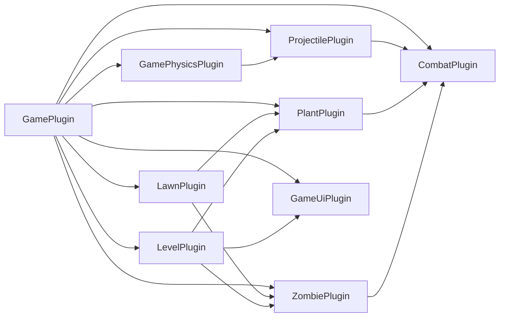

# bevy-pvz

一个使用 Bevy 与 Rapier 2D 编写的单关 PvZ 类游戏原型。项目已经接通种植、阳光经济、固定波次、战斗、两类弹丸、胜负和重开流程。

当前版本使用简单图形与文字作为占位表现，不包含原作受版权保护的素材。

## 当前完成度

- [x] Bevy `0.18.1`、bevy_rapier2d `0.34.0`、rapier2d `0.32.0`
- [x] 60 Hz 固定更新与明确的玩法/物理调度顺序
- [x] 最下面一条 9 格道路和点击种植
- [x] 向日葵、豌豆射手和坚果
- [x] 普通僵尸的行走、受阻、啃咬和死亡
- [x] 直线逻辑豌豆和 Rapier 抛射物理豌豆
- [x] 阳光拾取、资源消耗和植物卡片冷却
- [x] RON 配置的 4 波 11 只僵尸、胜利、失败和重开
- [x] HUD、占位 Sprite 和 Rapier 碰撞体调试渲染
- [x] 15 项自动化测试及零警告 Clippy 检查
- [ ] 原创精灵、动画、音效、粒子和命中反馈

## 快速开始

环境要求：Rust stable，首要运行平台为 Windows 桌面。

```powershell
cargo run
```

启动时直接显示 Rapier 碰撞体调试框：

```powershell
cargo run -- --debug
```

启用了 Bevy `dynamic_linking` 以改善开发期增量编译体验，因此开发时应优先使用 `cargo run`，不要把裸 `target/debug/bevy-pvz.exe` 当作可分发版本。

### 操作

| 输入 | 功能 |
| --- | --- |
| 点击植物卡片 | 选择向日葵、豌豆射手或坚果 |
| 鼠标左键 | 在草坪格子种植；点击黄色阳光时优先收集阳光 |
| `N` | 从草坪发射普通直线豌豆，用于弹丸调试 |
| `P` | 从草坪抛出受重力影响的物理豌豆 |
| `D` | 开关 Rapier 碰撞体调试渲染（也可用 `--debug` 启动时打开） |
| `R` | 随时重开当前关卡；胜负画面中开始新一局 |

HUD 显示当前阳光、已经派发的波次、击杀数、关卡时间、选中的植物、价格和剩余冷却。

## 玩法实现

### 草坪与种植

- 关卡从 `assets/levels/level_01.ron` 加载，修改后重新启动即可生效。
- 只保留原草坪最下面一条道路；僵尸按波配置等待时间、种类、数量和生成间隔。
- `LawnLayout` 集中管理列数、单元格尺寸、道路高度和世界原点。
- 世界坐标和 `GridCell` 的换算是无 ECS 的纯函数。
- `CellOccupancy` 保证一个格子只能存在一株植物。
- 种植请求统一检查格子、阳光和卡片冷却，成功后再原子扣费并占用格子。
- 植物死亡时释放占用，僵尸可以继续前进。

### 植物

| 植物 | 价格 | 作用 |
| --- | ---: | --- |
| 向日葵 | 50 | 周期性生成可点击收集的 25 点阳光 |
| 豌豆射手 | 100 | 道路前方存在僵尸时周期性发射普通豌豆 |
| 坚果 | 50 | 以较高生命值阻挡僵尸 |

植物配置包含价格、卡片冷却、生命值和行为参数；表现资源不参与战斗判定。

### 僵尸

普通僵尸使用两种逻辑状态：

- `Walking`：沿唯一道路向房屋方向移动。
- `Eating { target }`：检测到近距离同排植物后停止并周期性造成啃咬伤害。

僵尸使用 Rapier 运动学刚体，让物理豌豆能够稳定接触；接触力不会改变僵尸由游戏逻辑控制的移动规则。

### 两类弹丸

两条管线共享 `Projectile`、阵营、伤害、寿命、命中记录和 `ProjectileHit` 消息，但移动方式不同。

普通豌豆：

- 由固定更新系统直接推进位置，不受重力和接触力影响。
- 使用上一位置到新位置的 swept segment/AABB 查询命中最近目标。
- 即使低帧率下单帧跨过僵尸，也不会只依赖终点重叠检测。
- 默认命中后销毁。

物理豌豆：

- 使用 `RigidBody::Dynamic`、圆形 `Collider` 和初速度。
- 受重力、摩擦和恢复系数影响，可以落地、撞墙和弹跳。
- 开启 `Ccd`，降低高速运动时的穿透风险。
- Rapier `CollisionEvent` 会先转换成项目自己的 `ProjectileHit`，再进入统一伤害结算。
- `HitRegistry` 防止同一个物理豌豆对同一目标重复结算伤害。

## 架构



| 模块 | 主要职责 |
| --- | --- |
| `game/mod.rs` | 组合插件、相机、状态进入、关卡清理和重开 |
| `state.rs` | `GameState` 与关卡实体统一标记 |
| `schedule.rs` | 固定更新中的玩法 `GameSet` |
| `physics.rs` | Rapier 安装、调度、碰撞分组、地面/侧墙和调试开关 |
| `lawn.rs` | 单路草坪布局、格子坐标、占用和占位绘制 |
| `combat.rs` | 生命、阵营、伤害、死亡消息及实体清理 |
| `projectile.rs` | 两类弹丸的生成、移动、碰撞转换、伤害和寿命 |
| `plant.rs` | 种植、三种植物行为和死亡后的格子释放 |
| `zombie.rs` | 普通僵尸生成、状态切换、行走和啃咬 |
| `level.rs` | 阳光、卡片、输入、固定波次、统计和胜负 |
| `ui.rs` | HUD、操作提示、胜负画面和结果清理 |

玩法模块之间通过 `SpawnProjectile`、`ProjectileHit`、`ApplyDamage`、`EntityDied`、`SpawnZombie` 和 `SpawnSun` 等消息连接，避免植物、僵尸和弹丸系统相互直接修改内部状态。

### 游戏状态

```text
Loading -> Playing -> Victory
                   \-> Defeat

R: Playing / Victory / Defeat -> Loading -> Playing
```

离开 `Playing` 时，所有带 `LevelEntity` 的视觉、单位、弹丸和物理边界都会统一清理。

### 固定更新顺序

```text
FixedUpdate
  1. Spawn             波次派发、僵尸/植物/弹丸和阳光生成
  2. LogicMovement     僵尸逻辑、普通弹丸移动、植物行为和卡片计时
  3. Physics Sync      PhysicsSet::SyncBackend
  4. Physics Step      PhysicsSet::StepSimulation
  5. Physics Writeback PhysicsSet::Writeback
  6. ContactRead       普通弹丸查询与 Rapier 接触转换
  7. Combat            弹丸和啃咬伤害结算
  8. DeathAndCleanup   死亡、格子释放、弹丸寿命和越界清理
  9. LevelOutcome      统计击杀并检查胜负
```

最后一波会在 `Spawn` 阶段先派发、再生成僵尸，避免“最后一只尚未实体化但胜利检查已经成立”的竞态。

### 碰撞分层

当前保留以下 Rapier `Group`：

- `PLANT_GROUP`
- `ZOMBIE_GROUP`
- `NORMAL_PROJECTILE_GROUP`
- `PHYSICS_PROJECTILE_GROUP`
- `WORLD_BOUNDARY_GROUP`
- `MOWER_GROUP`

普通弹丸目前不创建 Rapier 刚体，其分组位为后续查询适配预留。物理弹丸接触僵尸、其他物理弹丸和世界边界。植物与僵尸的阻挡由道路上的距离逻辑决定，而不是由动力学接触力决定。

## 项目目录

```text
src/
  main.rs
  game/
    mod.rs
    state.rs
    schedule.rs
    physics.rs
    lawn.rs
    combat.rs
    projectile.rs
    plant.rs
    zombie.rs
    level.rs
    ui.rs
assets/
  levels/
    level_01.ron
```

当前规模下每个子系统使用单文件。等原创资源、动画和音效进入后，再按实际复杂度拆分表现层，避免提前制造空模块。

## 测试与质量门

```powershell
cargo fmt --all -- --check
cargo check --locked
cargo test --locked
cargo clippy --all-targets --locked -- -D warnings
```

现有 15 项自动化测试覆盖：

- 输入绑定冲突、内置内容目录和默认关卡定义校验。
- 草坪坐标双向换算、越界和占用规则。
- 生命扣减、死亡夹取和同帧多次伤害累计。
- 阳光扣费的原子性和植物卡片冷却。
- 最后一波在胜利检查前完成实体生成。
- 重新开始时按当前关卡定义重置运行状态。
- 高速普通弹丸的扫掠命中和垂直方向未命中排除。
- 普通弹丸与物理弹丸生成不同的运动组件组合。

物理弹跳、碰撞体对齐、大量动态弹丸和低帧率 CCD 表现仍以 `D` 调试渲染配合手动场景检查。

## 依赖与升级约束

Bevy 关闭默认 feature，只启用窗口、2D 渲染、UI、默认字体、多线程和动态链接所需能力，避免编译无关的 3D、GLTF、音频、场景和 Picking 栈。

当前停留在 Bevy `0.18.1`，因为发布版 bevy_rapier2d `0.34.0` 与其兼容。升级 Bevy `0.19` 时应：

- 等待正式兼容的 bevy_rapier2d 版本，不直接依赖未完成的 Draft PR。
- 在独立分支同时升级 Bevy 和 bevy_rapier2d。
- 重点回归固定调度、碰撞消息、Transform 写回、状态资源和 UI 文本。
- 保持 Rapier 类型集中在物理和弹丸模块，减少玩法层迁移面。

本机 Cargo 使用 rsproxy 源替换。Cargo 1.96 不会为 `cargo info` 自动推断替换后的 registry，因此使用：

```powershell
cargo rinfo bevy_rapier2d@0.34.0
```

它等价于 `cargo info bevy_rapier2d@0.34.0 --registry rsproxy`。

## Git 约定

- 所有开发都通过 Git 管理，不把构建产物、编辑器缓存或临时日志加入版本库。
- 提交标题使用简洁、可执行的中文，例如 `修复最后一波提前胜利问题`。
- 提交正文说明行为变化、关键设计、测试结果以及必要的兼容性影响。
- 一个提交保持一个连贯目的；重构和玩法变更尽量分开，方便审查与回退。
- 提交前至少运行格式检查、测试和 Clippy 质量门。

## 后续路线

- 使用原创精灵图集和动画替换占位色块。
- 添加音效、粒子、受击和死亡反馈。
- 增加铲子、天空阳光和小推车。
- 通过新的 `ProjectileDefinition` 扩展植物和物理弹丸。
- 为 Rapier 碰撞组、僵尸阻挡/恢复行走和状态清理补充更多集成测试。

## 暂不包含

- 原作受版权保护的图片、动画和音频。
- 多关卡、关卡编辑器和完整原作单位复刻。
- 联机、存档和回放。
- 在玩法稳定前进行对象池等提前优化。
